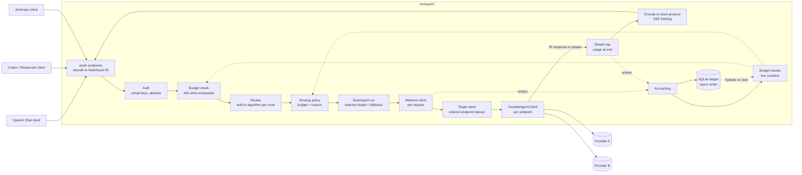
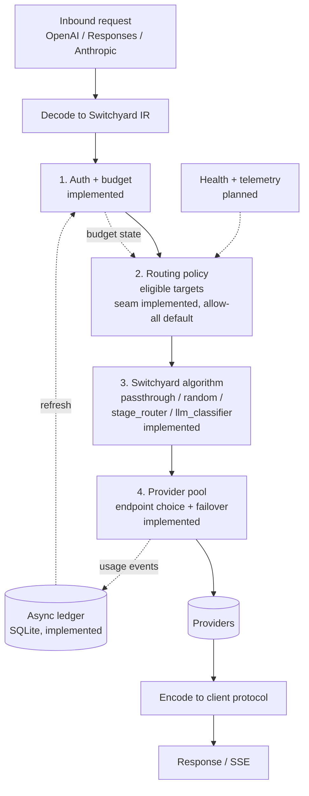

# Architecture

Living document. Update it in the same PR as any change that alters structure, request flow or
component status (see [AGENTS.md](../AGENTS.md)). Diagrams are Mermaid and render on GitHub.

Last updated: 2026-10-08 (`harden-engineering` implemented: invariants enforced by tests and CI, lints, structure refactors, property tests, ADRs; graceful ledger shutdown, health-aware policy and managed keys are next).

## Component status

| Component | Status | OpenSpec change |
|---|---|---|
| Inbound endpoints (OpenAI Chat, Responses, Anthropic) | Implemented | `add-core-gateway` |
| Protocol translation (Switchyard IR/codecs) | Implemented | `add-core-gateway` |
| Streaming proxy over Switchyard's `run` + `TranslatingLlmClient` | Implemented | `add-switchyard-routing` (group 3) |
| TOML config (providers, targets, routes) + CLI (`serve`, `check-config`) | Implemented | `add-core-gateway`, `add-switchyard-routing` (group 2) |
| Switchyard routing: passthrough, random, stage_router, llm_classifier; per-session state; whole-target fallbacks | Implemented | `add-switchyard-routing` (group 4) |
| Provider pool: multi-provider targets with ordered-endpoint failover | Implemented | `add-switchyard-routing` (group 3) |
| Routing-policy seam (eligibility hook, tier substitution, 503 when none eligible) | Implemented | `add-switchyard-routing` (group 5) |
| Virtual keys (hashed, `KeyStore` trait), usage ledger (SQLite, async), per-endpoint pricing | Implemented | `add-cost-tracking` |
| Budgets: UTC daily/monthly USD+token limits, restricted/exhausted states, 402, free-only, `/v1/key/info` | Implemented | `add-cost-tracking` |
| Provider health + telemetry feeding policy | Planned | not yet proposed |
| Engineering hardening: invariants + architecture test, lints, structure refactors, CI gates, property tests, ADRs | Implemented | `harden-engineering` |
| Database-managed keys + admin API | Planned (designed for in `add-cost-tracking`) | not yet proposed |
| `migrate-modelrelay` command + bundled catalog | Planned | not yet proposed |

## Current: request flow (implemented)

## Target: full pipeline (planned order is fixed)

Switchyard decides the macro question (which target); the provider pool answers the micro one
(which endpoint). Policy narrows targets before the algorithm runs; it does not change algorithms.

## Modules (src/)

| Module | Role |
|---|---|
| `config/` | TOML schema (`schema.rs`), cross-field validation (`validate.rs`), env-var key loading and the public `Config` (`mod.rs`) |
| `num.rs` | Checked integer/float conversions for money and token paths (the only lossy casts) |
| `error.rs` | Gateway errors rendered per client protocol |
| `policy.rs` | `RoutingPolicy` trait, `PolicyContext`, allow-all default |
| `auth.rs` | `KeyStore` trait, config-backed store, key hashing, `keygen` support |
| `budget.rs` | Live per-key counters (UTC day/month), budget states, `BudgetPolicy` |
| `ledger.rs` | SQLite usage ledger with async batching writer and period queries |
| `metering.rs` | Per-request metered clients, stream tap, answer/judge classification, `Accounting` |
| `pricing.rs` / `clock.rs` | micro-USD cost from usage; clock and UTC periods |
| `routing.rs` | Builds one long-lived Switchyard algorithm (and target groups) per route and per bare target; applies policy eligibility, tier substitution and random-weight realignment |
| `pool.rs` | Per-target `RoutedLlmClient`: ordered endpoints, failover, provider attribution header |
| `server.rs` | Router, handlers: decode, `run`, encode/SSE framing, attribution headers |
| `main.rs` / `lib.rs` | CLI and library root |

Tests: unit tests beside the code; end-to-end suites in `tests/` (shared helpers in
`tests/common/`); `tests/architecture.rs` enforces the layering rules; `tests/switchyard_assumptions.rs`
pins the Switchyard behaviors we rely on; property tests for pricing, budgets and numeric helpers
live in `#[cfg(test)] mod properties` blocks.

## Guardrails

What keeps the structure honest, and where each rule is written down:

- [invariants.md](invariants.md): the rules, each naming its enforcement.
- [adr/](adr/): the durable decisions (immutable).
- CI jobs (all required on `main`): `check`, `deny`, `docs`, `msrv`, `coverage`.
- Lints in `Cargo.toml`: no panics in production code, checked numeric conversions.

## Key decisions

- Reuse Switchyard's IR and codecs instead of hand-written provider types.
- Embed `switchyard-libsy`; the provider pool implements its `RoutedLlmClient` over `TranslatingLlmClient`, and dispatch runs through `switchyard-llm-client::run`.
- Config references API keys by env var only; modelrelay config comes in via a one-shot migration.
- Details and evidence: [background.md](background.md) and `openspec/`.
