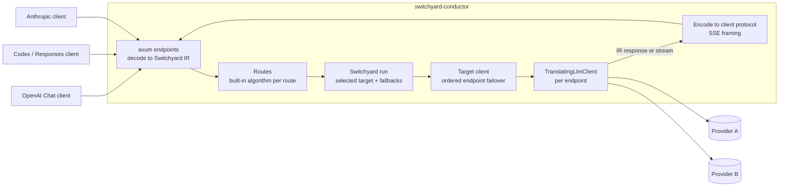

# Architecture

Living document. Update it in the same PR as any change that alters structure, request flow or
component status (see [AGENTS.md](../AGENTS.md)). Diagrams are Mermaid and render on GitHub.

Last updated: 2026-10-07 (`add-switchyard-routing` in progress: routes and the provider pool are live; the policy seam is next).

## Component status

| Component | Status | OpenSpec change |
|---|---|---|
| Inbound endpoints (OpenAI Chat, Responses, Anthropic) | Implemented | `add-core-gateway` |
| Protocol translation (Switchyard IR/codecs) | Implemented | `add-core-gateway` |
| Streaming proxy over Switchyard's `run` + `TranslatingLlmClient` | Implemented | `add-switchyard-routing` (group 3) |
| TOML config (providers, targets, routes) + CLI (`serve`, `check-config`) | Implemented | `add-core-gateway`, `add-switchyard-routing` (group 2) |
| Switchyard routing: passthrough, random, stage_router, llm_classifier; per-session state; whole-target fallbacks | Implemented | `add-switchyard-routing` (group 4) |
| Provider pool: multi-provider targets with ordered-endpoint failover | Implemented | `add-switchyard-routing` (group 3) |
| Routing-policy seam (eligibility hook) | Proposed | `add-switchyard-routing` (group 5) |
| Budget / cost tracking, virtual keys | Planned | not yet proposed |
| Provider health + telemetry feeding policy | Planned | not yet proposed |
| `migrate-modelrelay` command + bundled catalog | Planned | not yet proposed |

## Current: request flow (implemented)

## Target: full pipeline (planned order is fixed)

Switchyard decides the macro question (which target); the provider pool answers the micro one
(which endpoint). Policy narrows targets before the algorithm runs; it does not change algorithms.

## Modules (src/)

| Module | Role |
|---|---|
| `config.rs` | TOML schema, env-var key loading, validation |
| `error.rs` | Gateway errors rendered per client protocol |
| `routing.rs` | Builds one long-lived Switchyard algorithm (and target groups) per route and per bare target |
| `pool.rs` | Per-target `RoutedLlmClient`: ordered endpoints, failover, provider attribution header |
| `server.rs` | Router, handlers: decode, `run`, encode/SSE framing, attribution headers |
| `main.rs` / `lib.rs` | CLI and library root |

## Key decisions

- Reuse Switchyard's IR and codecs instead of hand-written provider types.
- Embed `switchyard-libsy`; the provider pool implements its `RoutedLlmClient` over `TranslatingLlmClient`, and dispatch runs through `switchyard-llm-client::run`.
- Config references API keys by env var only; modelrelay config comes in via a one-shot migration.
- Details and evidence: [background.md](background.md) and `openspec/`.
